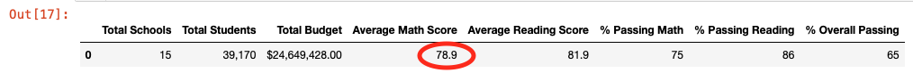

# School District Analysis

## Project Overview

Maria, the chief data scientist for a school city system, is responsible for analyzing standardized testing results used by the School Board and the School Superintendent in evaluating the efficacy of these tests and determining budgetary allocation among the schools.

The School Board has notified Maria and her supervisor that the data file containing all student scores shows evidence of academic dishonesty, specifically, reading and math scores for ninth graders at the Thomas High School.

Maria has requested our assistance in repeating the school district analysis by excluding the scores for Thomas High School ninth graders and comparing the results against her earlier analysis.

## Methodology

Utilizing the *pandas numpy* library and *python* coding on *jupyter notebooks*, and using the same development environment other analysts on the team have on their computers, we reproduced the school analysis excluding the math and reading scores for ninth graders at Thomas High School.

Our analysis utilized the same data files, mainly the *clean_students_complete.csv* and the *schools_complete.csv* data files (see Resources folder).

We utilized several *pandas* and *python* methods to summarize the data and calculate relevant averages for scores at different levels. These methods included the *loc()* method as well as the *groupby()* and *mean ()* methods. The data was then presented in summary data frames.

In reproducing the analysis, we followed the same methodology as the original project to obtain comparable results. However, we believe that the methodology used to calculate the averages for some of the summary data frames is statistically incorrect. We have added a note in our summary of findings which elaborates on this issue.

## School District Analysis Results

### Replacing Ninth-Grade Reading and Math Scores

In order to remove the ninth grade scores for Thomas High School, we performed a *loc()* search for all students that met two conditions, school is Thomas High School and grade is ninth grade, and ran the code first to replace reading scores for empty data (Nan's), and then repurposed the same code to replace math scores for Nan's as well. Below is the segment of code we utilized:

To verify that the code was effective, we listed a few lines of the data to make sure that only the score fields were changed. Below is the printout of the sample data records:

### Recreating the School District Analysis

To recreate the School District Analysis using the modified ninth grade data, we generated the following data frames which we compared to the initial School District Analysis results.

* The district summary
* The school summary
* The top 5 performing schools, based on the overall passing rate
* The bottom 5 performing schools, based on the overall passing rate
* The average math score for each grade level from each school
* The average reading score for each grade level from each school
* The scores by school spending per student 
* The scores by school size
* The scores by school type

The following tables show the compared before and after results.

#### (1) District Summary

To update the District Summary, we recalculated the total student count by subtracting the number of ninth-grade students in Thomas High School (461) from the total student count (38,709). We then recalculated the passing math and passing reading percentages, as well as the overall passing rates with the recalculated total student count. The following tables show the before and after District Summary data frames, highliting any observed differences.

##### District Summary - Before

##### District Summary - After

How is the District Summary affected? As can be seen from the results, there was a very small drop in the average math scores for the district, which fell from 79.0 to 78.9.

#### (2) School Summary

Likewise, we updated the School Summary based on the adjusted number of students after subtracting the Thomas High School ninth grade student count. The following tables show the before and after School Summary data frames, highlighting any observed differences.

##### School Summary - Before

##### School Summary - After

How is the School Summary affected? The scores for Thomas High School excluding the ninth graders show average math scores slightly *lower* (83.35 vs. 83.42), reading scores slightly *higher* (83.90 vs. 83.85), passing math rate slightly *lower* (93.2% vs. 93.3%), passing reading rate slightly *lower* (97.0% vs. 97.3%) and overall passing rate also slightly *lower* (90.6% vs. 90.9%)

#### (3) Top 5 Performing Schools

##### Top Performing Schools - before

##### Top Performing Schools - after

#### (4) Bottom 5 Performing Schools

##### Bottom Performing Schools - before

##### Bottom Performing Schools - after

Relative to the other schools, replacing the ninth grader's math and reading scores did not affect Thomas High School's ranking among all the district schools. It remains as the second highest ranking school in terms of overall passing rate among all schools in the district.

#### (5) Math Scores by Grade

##### Math Scores by grade - before

##### Math Scores by grade - after

#### (6) Reading Scores by Grade

##### Reading Scores by grade - before

##### Reading Scores by grade - after

As can be observed in both math and reading scores by grade, there is no change to the results other than showing ninth grade scores for Thomas High School as Nan's.

#### (7) Scores by Spending

##### Scores by Spending - before

##### Scores by Spending - after

Replacing ninth grade scores had no effect on the score by spending summary tables.

#### (8) Scores by Size

##### Scores by Size - before

##### Scores by Size - after

Replacing ninth grade scores had no effect on the score by size summary tables.

#### (9) Scores by Type

##### Scores by Type - before

##### Scores by Type - after

Replacing ninth grade scores had no effect on the score by type summary tables.

## Summary

The updated school district analysis, after replacing reading and math scores with Nan's for the ninth grade at Thomas High School, essentially produced four changes:

* There was a very small drop in the average math scores for the district, which fell from 79.0 to 78.9.

* Scores and passing rates for Thomas High School in the school summary were slightly lower (except for reading scores, which were slightly higher).

* Among school ranking based on overall passing rates, Thomas High School's scores were slightly lower, yet this did not affect its position in the ranking. Thomas High School remained second in the rank of top performing schools.

* The analysis did not consider Thomas High School average math score of 83.6 and average reading score of 83.7 for ninth grade students.

From the above results, we could not detect a measurable bias that could lead us to believe there was academic dishonesty in the math and reading scores among Thomas High School ninth graders.

As a note on methodology, we understand that average scores and passing rates for the Scores by Spending, Scores by Size and Scores by Type data frames should be based on averages calculated using student number weighting, in order to obtain accurate statistical results. The methodology utilized by Mary's team used simple averages (i.e an average of an average), calculated not on the granular data containing the individual student scores, but rather on a previously summarized result as contained in the *per_school_summary_df* data frame.